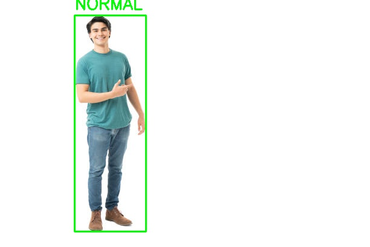

# 🧍‍♂️ Fall Detection System

Automatically detect when a person falls in a video using AI-driven pose estimation and tracking.

---

## 🎯 Purpose

- Analyze video footage to detect fall events
- Highlight fall incidents with confidence scores
- Export annotated video and a log of detected falls

---

## 🖼️ Demo Images

**Fall Detected**

**Normal Activity**

---

## 🎥 Demo Video

[▶️ Watch Demo Video](outputs/Woman%20Falls%20Off%20Treadmill_fall_detection.mp4)

---

## 📝 Output

- Video with bounding boxes and fall alerts
- JSON file containing:
  - Frame number
  - Timestamp
  - Person ID
  - Fall confidence
  - Detection message
